# Subscription Manager

เว็บแอปแบบ full-stack สำหรับจัดการบริการที่จ่ายเป็นรายเดือน/รายปี (Netflix, Spotify, iCloud ฯลฯ)
สร้างด้วย **Node.js + Express.js** เชื่อมต่อกับหน้าเว็บฝั่งไคลเอนต์ที่เขียนด้วย **HTML, CSS และ JavaScript (fetch API)**
มี REST API ครบ CRUD สำหรับ resource `subscriptions` และสรุปค่าใช้จ่ายต่อเดือน/ต่อปีของบริการที่ยังใช้งานอยู่

## ฟีเจอร์

- เพิ่ม / แก้ไข / ลบ / เปิด-ปิดการใช้งาน ผ่าน `fetch()` โดยไม่โหลดหน้าใหม่
- กรองด้วย query string (รอบชำระ, หมวด, สถานะ) ค้นหาชื่อ และเรียงลำดับ (ราคา, วันชำระ, ชื่อ)
- สรุปค่าใช้จ่ายต่อเดือน/ต่อปี พร้อมแถบแสดงสัดส่วนค่าใช้จ่ายแต่ละหมวด
- ป้ายนับถอยหลังวันชำระ (อีก N วัน / เลยกำหนด) ไอคอนและสีประจำหมวด ข้อความแจ้งเตือนหลังทำรายการ
- รองรับโหมดมืด/สว่างอัตโนมัติ

## โครงสร้างโปรเจกต์

```
subscription-manager/
├── server/
│   ├── server.js        # Express + REST API
│   └── data.json        # ที่เก็บข้อมูล (JSON file)
├── public/
│   ├── index.html
│   ├── style.css
│   └── app.js           # เรียก API ด้วย fetch()
├── docs/
│   ├── report.pdf       # รายงานการออกแบบ REST API
│   └── screenshots/     # ภาพหน้าจอ
├── package.json
└── README.md
```

## วิธีติดตั้งและรัน

```bash
npm install
npm run dev     # หรือ npm start
```

เปิดเบราว์เซอร์ที่ http://localhost:3000

## Data model

| Field | ชนิด | หมายเหตุ |
|---|---|---|
| id | number | สร้างอัตโนมัติ |
| name | string | จำเป็น |
| price | number | จำเป็น ตั้งแต่ 0 ขึ้นไป (บาท) |
| billing | string | จำเป็น: `monthly` หรือ `yearly` |
| category | string | `entertainment`, `music`, `cloud`, `education`, `other` (ค่าเริ่มต้น other) |
| nextPayment | string | วันที่ชำระครั้งถัดไป YYYY-MM-DD |
| active | boolean | เริ่มต้น true |
| createdAt | string | ISO date ใส่โดยเซิร์ฟเวอร์ |

## API Endpoints

| Method | Path | คำอธิบาย | Status |
|---|---|---|---|
| GET | `/api/subscriptions` | ดึงทั้งหมด กรองด้วย `?billing=`, `?category=`, `?active=` ค้นหาชื่อด้วย `?q=` เรียงด้วย `?sort=price&order=desc` (sort: name, price, nextPayment) | 200 |
| GET | `/api/subscriptions/:id` | ดึงรายการเดียว | 200 / 404 |
| POST | `/api/subscriptions` | เพิ่มรายการ ต้องมี name, price, billing | 201 / 400 |
| PATCH | `/api/subscriptions/:id` | แก้ไขบางส่วน (รวมถึงเปิด/ปิด active) | 200 / 400 / 404 |
| DELETE | `/api/subscriptions/:id` | ลบรายการ | 204 / 404 |

### ตัวอย่างการเรียกใช้

```bash
# ดึงทั้งหมด / กรอง / ค้นหา / เรียงลำดับ
curl "http://localhost:3000/api/subscriptions"
curl "http://localhost:3000/api/subscriptions?billing=monthly"
curl "http://localhost:3000/api/subscriptions?q=net&sort=price&order=desc"

# ดึงรายการเดียว -> 200 / ไม่พบ -> 404
curl -i http://localhost:3000/api/subscriptions/1
curl -i http://localhost:3000/api/subscriptions/99

# เพิ่ม -> 201 (ข้อมูลไม่ครบ -> 400)
curl -i -X POST http://localhost:3000/api/subscriptions \
  -H "Content-Type: application/json" \
  -d '{"name":"Disney+","price":199,"billing":"monthly","category":"entertainment"}'

# แก้ไข -> 200 (ไม่พบ -> 404)
curl -i -X PATCH http://localhost:3000/api/subscriptions/1 \
  -H "Content-Type: application/json" -d '{"active":false}'

# ลบ -> 204
curl -i -X DELETE http://localhost:3000/api/subscriptions/1
```

## ภาพหน้าจอ

### หน้าหลัก
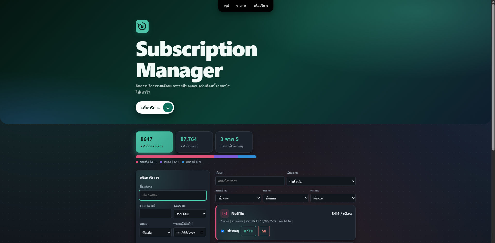

### เพิ่มบริการ
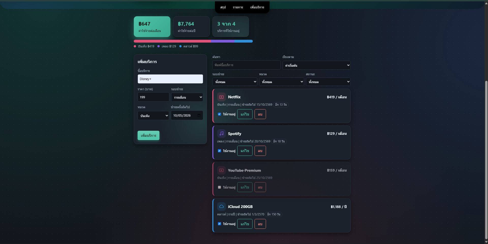
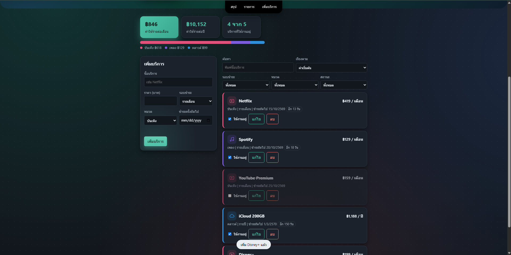

### แก้ไขบริการ
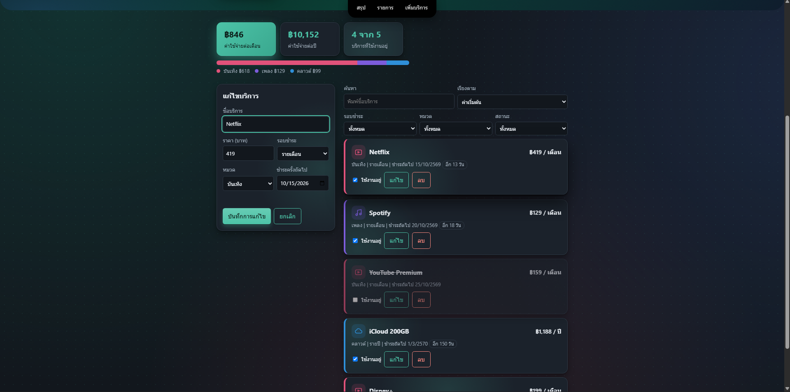
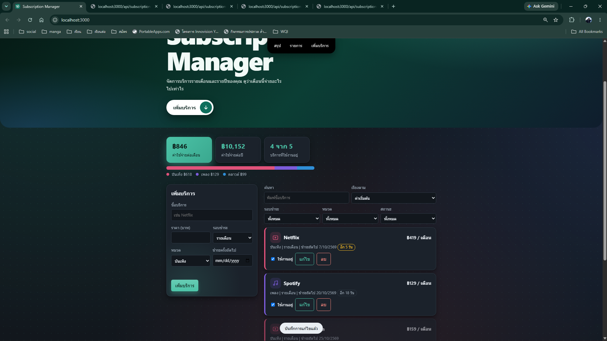

### ลบบริการ
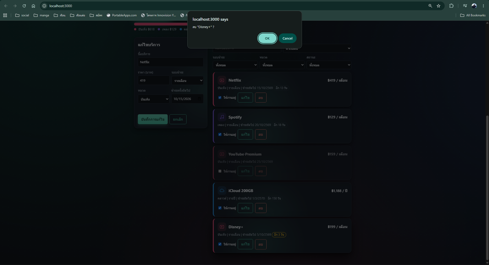
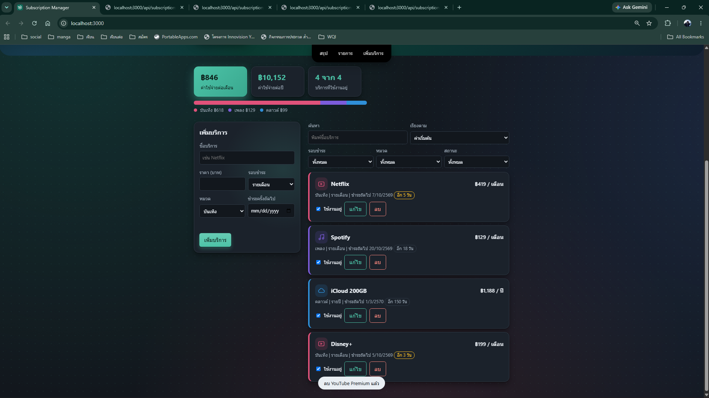

### ทดสอบ API
**GET ทั้งหมด**

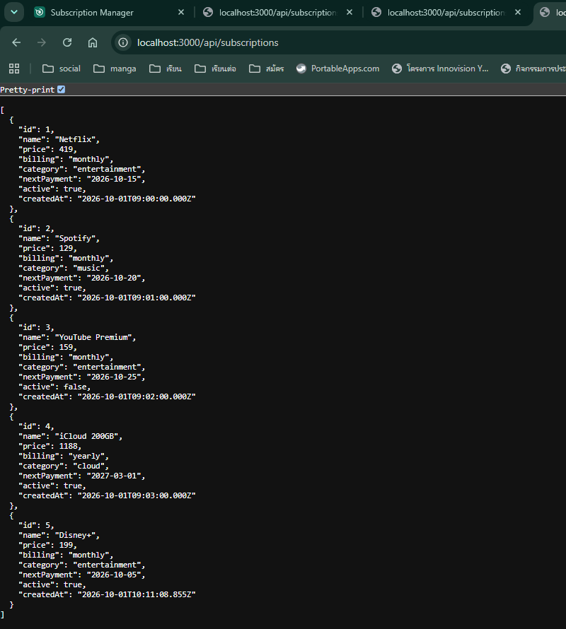

**GET ด้วย id**

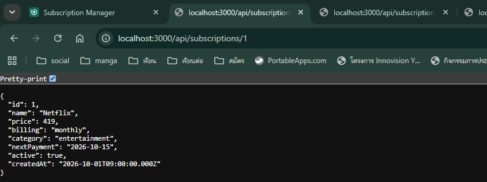

**GET id ที่ไม่พบ (404)**

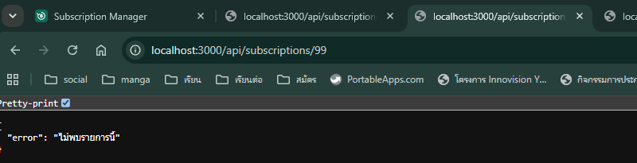

**กรองด้วย query string**

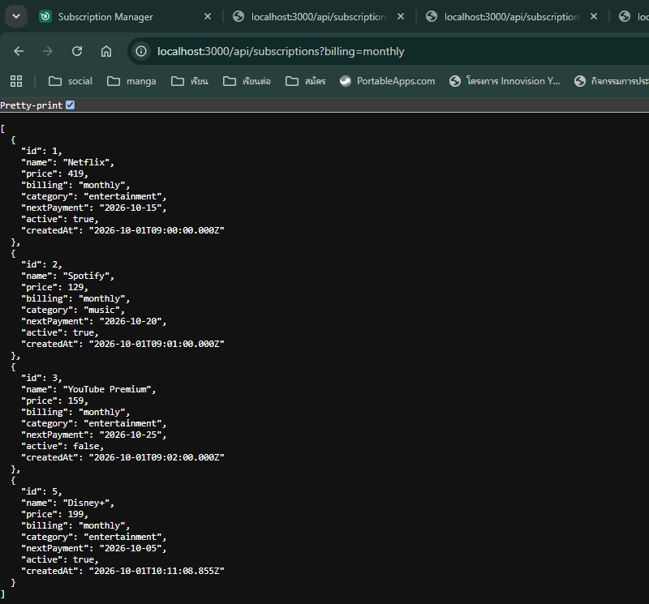

**POST ข้อมูลไม่ครบ (400)**

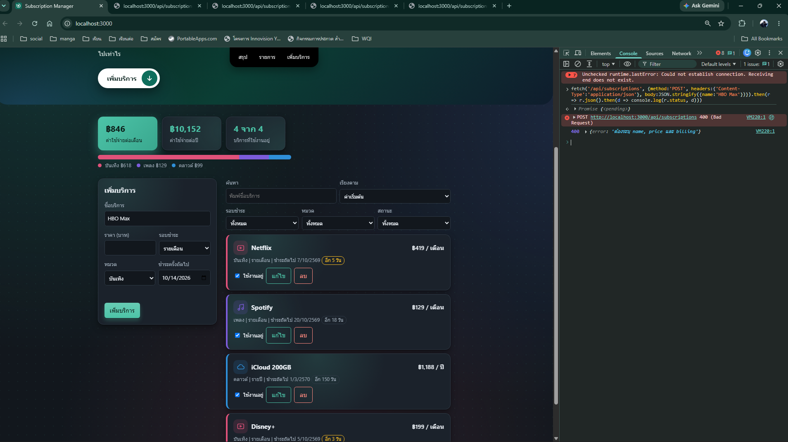

**PATCH id ที่ไม่พบ (404)**

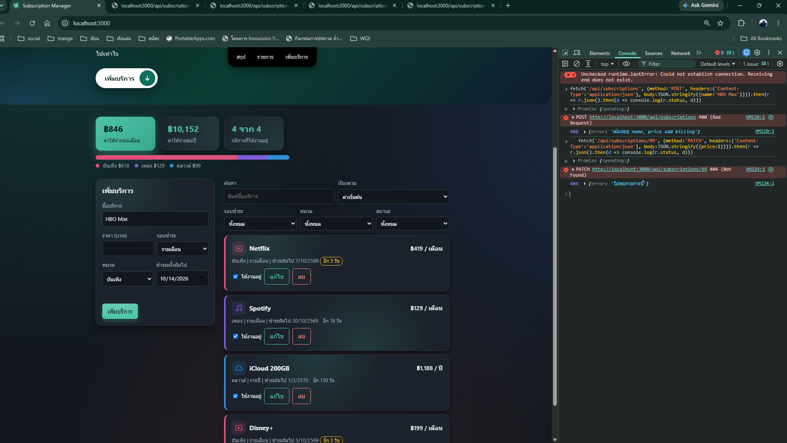

**ตรวจข้อมูลฝั่งเบราว์เซอร์เมื่อไม่กรอกราคา**

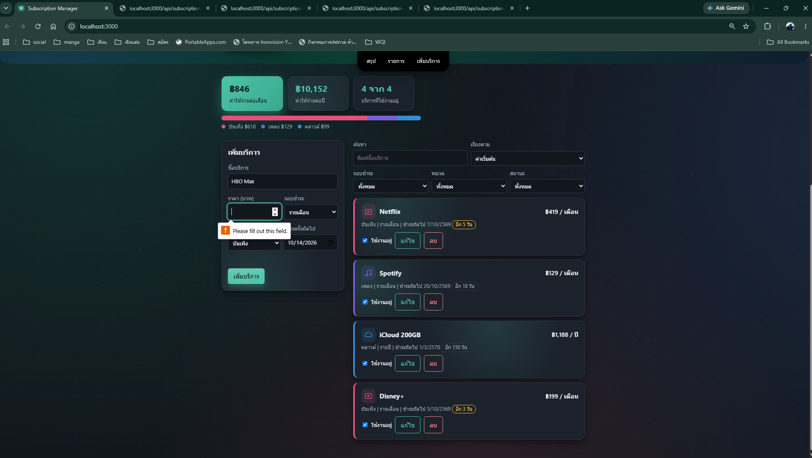

## เทคโนโลยีที่ใช้

Node.js, Express.js, HTML, CSS, JavaScript (fetch API) เรียกเฉพาะ API ของตัวเอง ไม่ดึงข้อมูลจาก API ภายนอก
